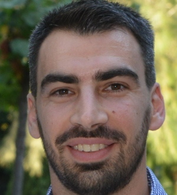
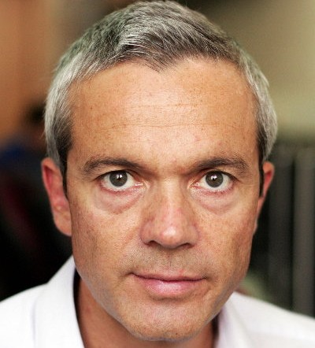

# Clonos: Consistent Causal Recovery for Highly-Available Streaming Dataflows


## Abstract
Stream processing lies in the backbone of modern businesses, being
employed for mission critical applications such as real-time fraud
detection, car-trip fare calculations, traffic management, and stock
trading. Large-scale applications are executed by scale-out stream
processing systems on thousands of long-lived operators, which are
subject to failures. 

Recovering from failures fast and consistently are
both top priorities, yet they are only partly satisfied by existing fault
tolerance methods due to the strong assumptions these make. In
particular, prior solutions fail to address consistency in the presence
of nondeterminism, such as calls to external services, asynchronous
timers and processing-time windows.

This paper describes Clonos, a fault tolerance approach that
achieves fast, local operator recovery with exactly-once guarantees
and high availability by instantly switching to passive standby
operators. Clonos enforces causally consistent recovery, including
output deduplication, by tracking nondeterminism within the system 
through causal logging. 

To implement Clonos we re-engineered
many of the internal subsystems of a state of the art stream processor.
We evaluate Clonos’ overhead and recovery on the Nexmark
benchmark against Apache Flink. Clonos achieves instant recovery
with negligible overhead and, unlike previous work, does not make
assumptions on the deterministic nature of operators.

## Authors

<figure class="item" style="vertical-align:top; display: inline-block; text-align:center; width:150px">
    <a href="https://www.doc.ic.ac.uk/~pms20/"></a>
    <figcaption class="caption" style="display:block">Pedro F. Silvestre <br>TU Delft</figcaption>
</figure>


<figure class="item" style="vertical-align:top; display: inline-block; text-align:center; width:150px">
    <a href="http://mariosfragkoulis.gr/"></a>
    <figcaption class="caption" style="display:block">Marios Fragkoulis <br> TU Delft</figcaption>
</figure>

<figure class="item" style="vertical-align:top; display: inline-block; text-align:center; width:150px">
    <a href="https://www.spinellis.gr"></a>
    <figcaption class="caption" style="display:block">Diomidis Spinellis <br>TU Delft</figcaption>
</figure>

<figure class="item" style="vertical-align:top; display: inline-block; text-align:center; width:150px">
    <a href="http://asterios.katsifodimos.com/"></a>
    <figcaption class="caption" style="display:block">Asterios Katsifodimos <br>TU Delft</figcaption>
</figure>


## Repositories

## Cite Clonos

```
@article{silvestre2021clonos,
  title={Clonos: Consistent Causal Recovery for Highly-Available Streaming Dataflows},
  author={Silvestre, Pedro F and Fragkoulis, Marios and Spinellis, Diomidis and Katsifodimos, Asterios},
  year={2021}
}
```
